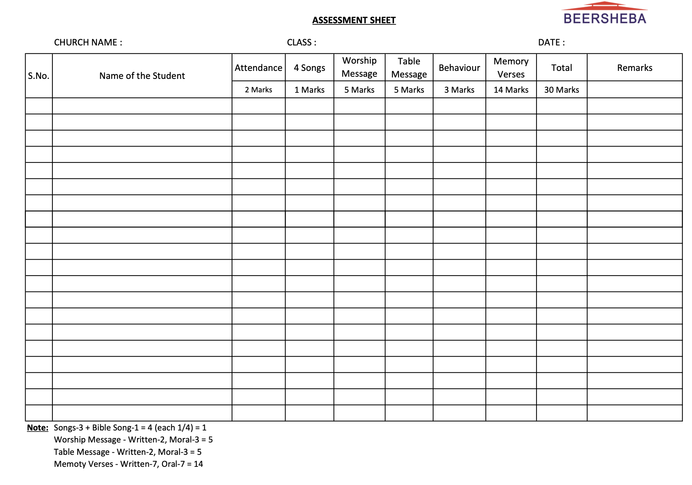

# Church Sunday School Platform

A web platform for managing Sunday School operations at Beersheba Church.  
The platform digitizes attendance, student records, teacher assignments, and assessment marks, replacing manual paper-based workflows for 300+ students.  

## Project Background

Beersheba is an organization of 7 churches. For years, they managed everything — from offerings to utilities — using paper records. Over time, this approach became difficult because:

- Paper records were easily misplaced or damaged.
- Searching through archives for student or teacher details was slow and error-prone.
- Collaboration across 7 churches was nearly impossible without a shared system.
- Generating reports (attendance, assessments, or finances) required hours of manual work.

To solve this, I collaborated with my friend to build a digital platform for church management, starting with finances and expenses. After its success, the organization wanted a similar system for their Sunday School.

This project was born to provide a centralized digital platform for all churches to manage:

- Student records
- Teacher assignments
- Attendance and assessments
- Reports and analytics

The result is a modern, reliable, and scalable platform that makes Sunday School administration simpler, faster, and more accurate.

## Features  

- **Assessments** – Teachers can add, manage, and edit student assessment marks.  
- **Authentication** – Secured with JWT-based login (access tokens).  
- **Reports** – Auto-generated PDF reports (via backend).  
- **Teacher Management** – Add, view, edit, and delete teacher records.  
- **Student Management** – Add, view, edit, and delete student records.  

### PDF Reports  

One of the key features of this platform is automated PDF report generation.  
Reports replace manual Excel/paper sheets and provide a standardized format for attendance, assessments, and offerings across all 7 churches.  

Example of a generated report:  

## Tech Stack  

- **Backend:** Java Spring Boot  
- **Frontend:** React
- **Database:** MySql  
- **Auth:** JWT Bearer Tokens  
- **Deployment:** AWS (private now)

